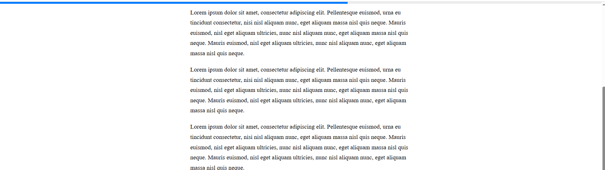

# Barra de Progresso de Leitura (Scroll Progress Bar)

Este projeto foi desenvolvido como parte de um desafio proposto pelo professor Luan. O objetivo é criar uma barra de progresso fixa no topo da página que indica quanto falta para ler o conteúdo, de forma simples e elegante.

## Funcionalidades
- Calcula a porcentagem de rolagem da página em tempo real
- Exibe uma barra de progresso fixa no topo
- Atualiza a largura da barra conforme o usuário rola a página
- Fácil de usar e personalizar
- Código simples e direto

## Como usar
1. Abra o arquivo `index.html` em seu navegador.
2. Role a página para ver a barra de progresso sendo atualizada no topo.
3. A barra reflete o quanto falta para terminar de ler a página.

## Demonstração
Veja abaixo uma imagem de demonstração do projeto:

## Autor
Victor Nascimento

## Desafio proposto pelo Prof. Luan